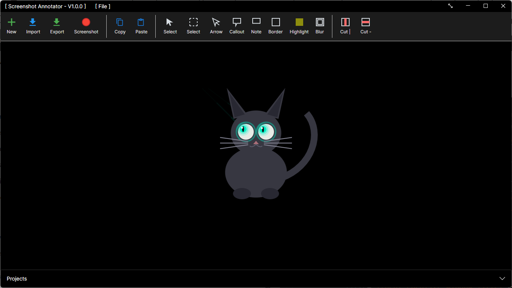
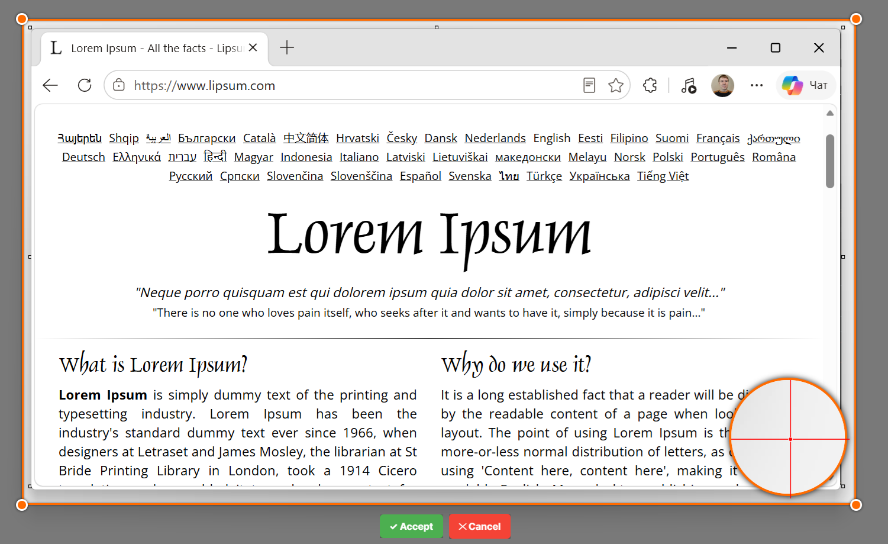
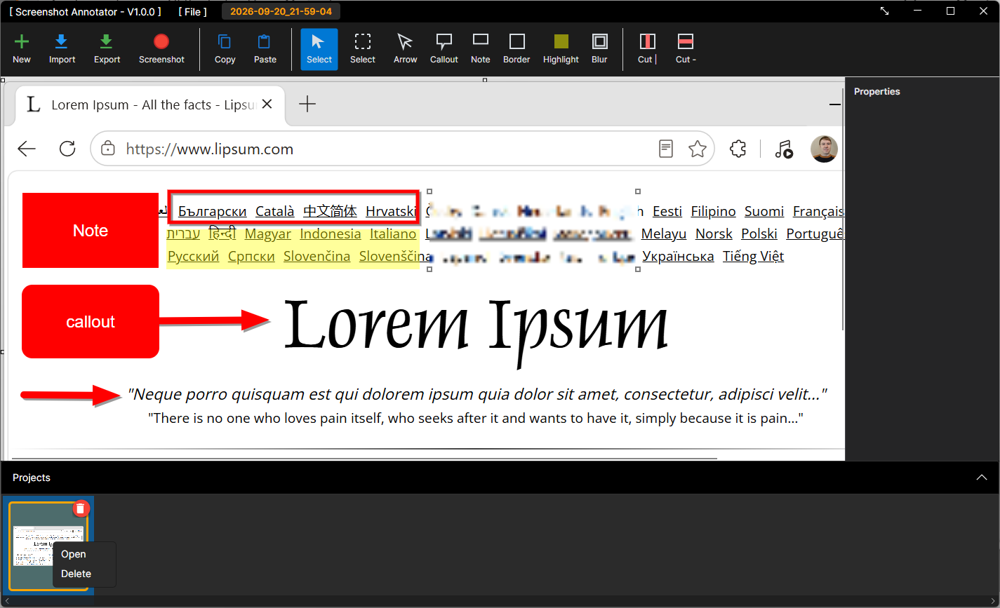
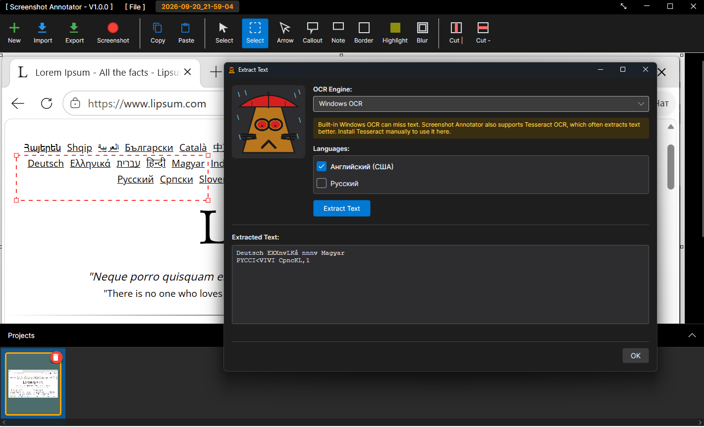

# Screenshot Annotator

Screenshot annotator software for Windows and Linux.

## Features

- **Arrows** - Draw attention to specific areas with customizable arrows
- **Callouts** - Add speech bubble annotations with editable text
- **Notes** - Create text boxes for additional information
- **Border Selection** - Highlight areas with bordered rectangles
- **Blur** - Obscure sensitive information with blur effects
- **Selection Tool** - Select portions of the image to copy (Ctrl+C) or delete (Delete key)
- **Cut out vertical and horizontal slices** - Cut out vertical or horizontal areas of image
- **Highlighter** - Highlights areas of interest
- **Project Management** - Automatic project saving and preview thumbnails
- **Cross-Platform** - Works on both Windows and Linux
- **OCR** via Tesseract and Windows.Media.OCR.

## Screenshots










<details>
<summary>🌐 Supported languages (57)</summary>

Amharic, Arabic, Azerbaijani, Bengali, Burmese, Cebuano, Chinese Simplified, Czech,
Dutch, Filipino, French, German, Greek, Gujarati, Hausa, Hebrew, Hindi, Hungarian,
Igbo, Indonesian, Italian, Japanese, Kannada, Kazakh, Khmer, Korean, Malay, Marathi,
Nepali, Nigerian Pidgin, Odia, Pashto, Persian, Polish, Portuguese, Punjabi, Romanian,
Russian, Serbian, Sindhi, Sinhala, Somali, Spanish, Swahili, Swedish, Tamil, Telugu,
Thai, Turkish, Ukrainian, Urdu, Uzbek, Vietnamese, Yoruba, Yue Chinese, Zulu,
**English** *(default)*

</details>


## 📦 Installation Options

<details>

<summary>📦 Installation for Windows</summary>

A. [Microsoft Store](https://apps.microsoft.com/detail/9nfpjcs6r9r6)

Best option. Store will keep application up to date.

B. WinGet

```
winget install --id SiarheiKuchuk.ScreenshotAnnotator
```

C. Setup [look for asset **windows_setup.exe**](https://github.com/drweb86/annotator/releases/latest)

Setup is good when you can't use Store (no Microsoft Account, etc). Application will check for self-updates however you should manually update the application.

D. Binaries [look for windows_archive.7z](https://github.com/drweb86/annotator/releases/latest)

Binaries are good if setups and zip archives are blocked by corporate policies. Application will check for self-updates however you should manually update the application.

</details>

<details>

<summary>📦 Installation for Linux</summary>

A. Installation via APT Repository

Best option. System will keep application updated.

One-Time Setup - add repository

```
curl -fsSL https://drweb86.github.io/annotator/gpg-key.pub | sudo gpg --dearmor -o /usr/share/keyrings/screenshot-annotator.gpg
echo "deb [arch=$(dpkg --print-architecture) signed-by=/usr/share/keyrings/screenshot-annotator.gpg] https://drweb86.github.io/annotator stable main" | sudo tee /etc/apt/sources.list.d/screenshot-annotator.list > /dev/null
```

Install

```
sudo apt update && sudo apt install screenshot-annotator
```

Update

```
sudo apt update && sudo apt upgrade screenshot-annotator
```

Uninstall

```
sudo apt remove screenshot-annotator
sudo rm /etc/apt/sources.list.d/screenshot-annotator.list /usr/share/keyrings/screenshot-annotator.gpg
```

B. DEB [look for asset linux_arm64.deb and linux_amd64.deb](https://github.com/drweb86/annotator/releases/latest)

For amd64:

```
sudo dpkg -i screenshot-annotator_*_linux_amd64.deb
sudo apt-get install -f
```

For ARM64:

```
sudo dpkg -i screenshot-annotator_*_linux_arm64.deb
sudo apt-get install -f
```

Uninstall

```
sudo apt remove screenshot-annotator
```

C. Bash script

Installation:

`wget -O - https://raw.githubusercontent.com/drweb86/annotator/master/scripts/ubuntu-install.sh | bash`

Installation of preview:

`wget -O - https://raw.githubusercontent.com/drweb86/annotator/master/scripts/ubuntu-install.sh | bash -s -- --latest`

Uninstallation (source install only):

`wget -O - https://raw.githubusercontent.com/drweb86/annotator/master/scripts/ubuntu-uninstall.sh | bash`

After installation, the following command is available: **`screenshot-annotator`** — graphical application.

</details>

## Technology Stack

- Built with [Avalonia UI](https://avaloniaui.net/) for cross-platform support
- .NET 10
- SkiaSharp for image processing

## Development

This project was developed with AI assistance from Claude (Anthropic's AI assistant); Cursor.
